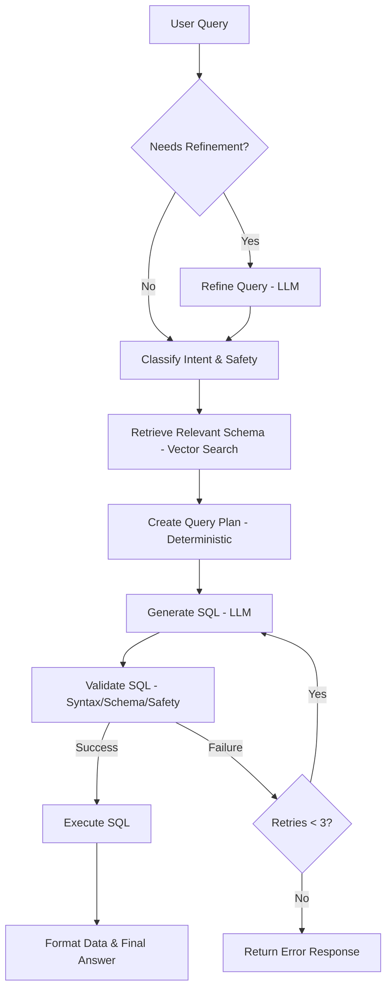

# NL2SQL Agent

An advanced agentic system that converts Natural Language Queries (NLQ) into SQL, executes them against a database, and provides natural language responses. Powered by a local **Llama-3.2-3B-Instruct** model.

## 🚀 Features

- **Conditional Query Refinement**: Automatically detects and cleans up messy or ambiguous queries using an LLM, only when necessary.
- **Intent & Safety Classification**: Fast, keyword-based classifier to ensure requests are safe and data-related (no LLM overhead).
- **Vector-Based Schema Retrieval**: Uses vector search (ChromaDB) to identify relevant tables, focusing the agent's attention and reducing hallucinations.
- **Deterministic Planning**: A plan-driven approach that identifies columns, joins, and aggregates before writing any SQL.
- **Intelligent Column Selection**: Smart mapping of query intent to specific schema columns (avoiding `SELECT *`).
- **Plan-Driven SQL Generation**: Strict adherence to the execution plan ensures the LLM generates accurate and valid SQLite queries.
- **Consolidated Validation**: Single-pass check for syntax, safety, and schema correctness (table/column existence).
- **Self-Correction Loop**: Automatically fixes errors by feeding validator/executor feedback back to the generator (up to 3 retries).

## 🏗️ Architecture

The agent follows a strict, linear pipeline designed for accuracy and reliability:



1.  **Refine (Conditional)**: LLM-based cleanup (only if query is short, contains typos, or slang).
2.  **Classify**: Deterministic Intent & Safety check.
3.  **Retrieve Schema**: Vector search for the top most relevant tables.
4.  **Plan**: Deterministic logic to build a structured query plan.
5.  **Generate**: LLM-based SQL generation strictly following the plan.
6.  **Validate**: Combined Syntax + Safety + Schema check.
7.  **Execute**: Run SQL against the SQLite database.
8.  **Self-Correction**: Loop back to step 5 on failure with detailed error hits.

## 🛠️ Tech Stack

- **LLM**: meta-llama/Llama-3.2-3B-Instruct (Local via 🤗 Transformers)
- **Embeddings**: sentence-transformers/all-MiniLM-L6-v2
- **Vector Store**: ChromaDB
- **Orchestration**: LangChain
- **Database**: SQLite

## 📦 Installation

1.  **Clone the repository**:
    ```bash
    git clone https://github.com/gh-madhu1/nlq-agent.git
    cd nlq-agent
    ```

2.  **Create a virtual environment**:
    ```bash
    python3 -m venv .venv
    source .venv/bin/activate
    ```

3.  **Install dependencies**:
    ```bash
    pip install -r requirements.txt
    ```

4.  **Initialize the Database**:
    ```bash
    python3 utils/init_db.py
    ```

5.  **Index the Schema**:
    ```bash
    python3 utils/index_schema.py
    ```

## 🏃 Usage

### Interactive CLI
Run the interactive agent in the terminal:

```bash
python3 agent.py
```

### Server Mode (SSE Streaming)
Start the FastAPI server to stream agent steps:

```bash
uvicorn server:app --host 0.0.0.0 --port 8000
```

Consume the stream (example):

```bash
curl -N "http://localhost:8000/stream?query=How+many+users+are+there?"
```

### Example Queries

- "How many users are there?"
- "List all products under Electronics category."
- "What is the total amount of order 1?"
- "Show me the email of user 'Alice Smith'."
#### Try these complex queries:

- "How many products are in each category?"
- "List all Electronics products under $100"
- "What did Alice purchase?"
- "Show orders from the last 30 days"
- "What's the total revenue from all orders?"
- "Which products are low in stock (less than 50)?"

## 🧪 Testing

Run the test suite:

```bash
# Run mock integration tests (does not require full model load)
python3 -m unittest tests/test_agent_mock.py

# Run LLM client unit tests
python3 -m unittest tests/test_llm_client.py
```

## ⚡ Performance Optimization (vLLM)

For high-throughput inference (especially in production or on Linux/GPU servers), it is recommended to use **vLLM**.

### 1. Start a vLLM Server
```bash
python3 -m vllm.entrypoints.openai.api_server \
    --model meta-llama/Llama-3.2-3B-Instruct \
    --port 8000
```

### 2. Configure the Agent
Set the following environment variables (or in a `.env` file):
```bash
VLLM_BASE_URL="http://localhost:8000/v1"
```

Initialize the agent with the `vllm` provider:
```python
llm = LLMClient(model_provider="vllm")
```

## 📂 Project Structure

```
├── agent.py                 # Main entry point and agent loop
├── handlers/                # Agent components
│   ├── query_refiner.py     # Conditional query cleaning
│   ├── intent_safety.py     # Intent classification
│   ├── retriever.py         # Vector-based schema retrieval
│   ├── planner.py           # Query planning with intelligent column selection
│   ├── generator.py         # Plan-driven SQL generation
│   ├── validator.py         # Consolidated syntax/safety/schema validation
│   ├── executor.py          # SQL execution
│   └── formatter.py         # Response formatting
├── utils/                   # Utilities
│   ├── db_manager.py        # Database interactions
│   ├── llm_client.py        # LLM wrapper (Local Llama 3.2)
│   ├── vector_store.py      # Vector DB operations
│   ├── init_db.py           # DB logic
│   └── index_schema.py      # Schema indexing
├── tests/                   # Test suite
│   ├── test_agent_mock.py   # Mocked agent tests
│   └── test_llm_client.py   # LLM client tests
├── data/                    # Data storage (SQLite, ChromaDB)
└── requirements.txt         # Project dependencies
```
