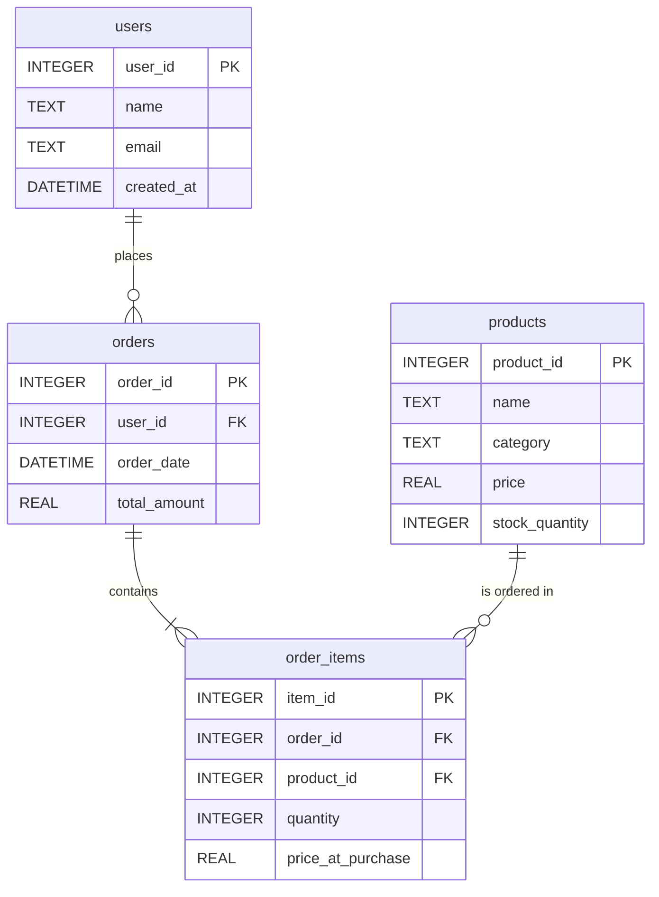

# 📊 NLQ Agent — Data Documentation

## Overview

The NLQ Agent uses a **SQLite** database (`sample.db`) as its data source. It contains a small **e-commerce** dataset modeling users, products, orders, and order line items. This database is designed to demonstrate the agent's ability to convert natural language questions into SQL queries.

## Entity-Relationship Diagram



## Table Details

### `users`
Registered users of the e-commerce platform.

| Column | Type | Constraints | Description |
|---|---|---|---|
| `user_id` | INTEGER | PRIMARY KEY | Auto-incrementing user ID |
| `name` | TEXT | NOT NULL | Full name |
| `email` | TEXT | UNIQUE, NOT NULL | Email address |
| `created_at` | DATETIME | DEFAULT CURRENT_TIMESTAMP | Registration timestamp |

### `products`
Product catalog with pricing and inventory.

| Column | Type | Constraints | Description |
|---|---|---|---|
| `product_id` | INTEGER | PRIMARY KEY | Auto-incrementing product ID |
| `name` | TEXT | NOT NULL | Product name |
| `category` | TEXT | — | Product category (e.g., "Electronics") |
| `price` | REAL | — | Current price in USD |
| `stock_quantity` | INTEGER | — | Units currently in stock |

### `orders`
Customer orders with totals. Each order belongs to one user.

| Column | Type | Constraints | Description |
|---|---|---|---|
| `order_id` | INTEGER | PRIMARY KEY | Auto-incrementing order ID |
| `user_id` | INTEGER | FK → `users.user_id` | Customer who placed the order |
| `order_date` | DATETIME | DEFAULT CURRENT_TIMESTAMP | When the order was placed |
| `total_amount` | REAL | — | Order total in USD |

### `order_items`
Line items within an order. Links orders to products with quantity and price snapshot.

| Column | Type | Constraints | Description |
|---|---|---|---|
| `item_id` | INTEGER | PRIMARY KEY | Auto-incrementing item ID |
| `order_id` | INTEGER | FK → `orders.order_id` | Parent order |
| `product_id` | INTEGER | FK → `products.product_id` | Purchased product |
| `quantity` | INTEGER | — | Number of units purchased |
| `price_at_purchase` | REAL | — | Unit price at time of purchase |

## Relationships

| Relationship | Type | Description |
|---|---|---|
| `users` → `orders` | One-to-Many | A user can place multiple orders |
| `orders` → `order_items` | One-to-Many | An order contains one or more line items |
| `products` → `order_items` | One-to-Many | A product can appear in many order items |

## Sample Data

The database ships with minimal seed data for testing:

- **2 users**: Alice Smith, Bob Jones
- **3 products**: Laptop ($1,200), Mouse ($25), Keyboard ($75) — all Electronics
- **1 order**: Alice's order totaling $1,225 (1 Laptop + 1 Mouse)

## Example Queries

| Natural Language | Generated SQL |
|---|---|
| "How many users are there?" | `SELECT COUNT(*) FROM users;` |
| "List all products under $100" | `SELECT * FROM products WHERE price < 100;` |
| "What did Alice order?" | `SELECT p.name, oi.quantity, oi.price_at_purchase FROM order_items oi JOIN orders o ON oi.order_id = o.order_id JOIN users u ON o.user_id = u.user_id JOIN products p ON oi.product_id = p.product_id WHERE u.name = 'Alice Smith';` |
| "Total revenue by product" | `SELECT p.name, SUM(oi.quantity * oi.price_at_purchase) AS revenue FROM order_items oi JOIN products p ON oi.product_id = p.product_id GROUP BY p.name;` |

## Initialization

To regenerate the database and vector index from scratch:

```bash
# 1. Create the SQLite database with sample data
python3 utils/init_db.py

# 2. Index the schema into ChromaDB for vector search
python3 utils/index_schema.py
```
